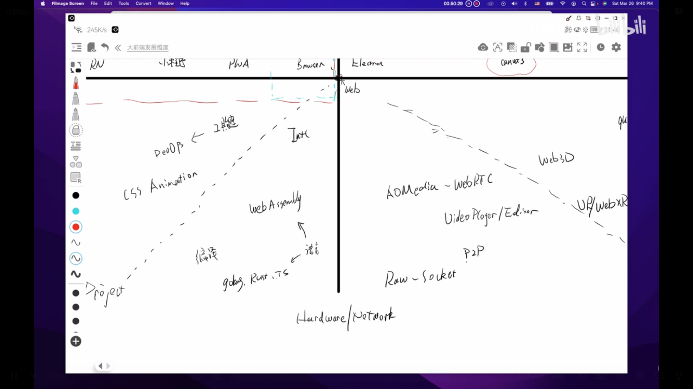

# 前端技术发展方向

本文章的内容来自：[前端视界：上帝视角纵览前端开发涉及的大部分领域_哔哩哔哩_bilibili](https://www.bilibili.com/video/BV1zY411E7Yw?spm_id_from=333.999.0.0)

## 横轴--ui驱动 全端、全栈

### moblie方向

- Browser

- PWA : 脱离浏览器的窗口做的基于浏览器的应用，用到的技术都是web相关的，拓宽了我们之前只用于浏览器的一亩三分地的局面
- 小程序 : 小程序底层基于vue，摆脱纯粹的基于浏览器开发，更丰富的交互，相机，语音，支付等等
- Hybrid : 混合开发，提供web-view(内嵌浏览器)的壳，提供了一些更底层的接口
- RN : 完全脱离了web的思维，基于react视图描述的思维，应用层是前端来做，布局、交互等等的思维都不一样
- flutter : 移动ui框架，底层基于Dart
- uniapp : vue，一套代码多端复用

### 桌面端方向

- Electron ：桌面端
- canvas ：网页内容全部渲染在canvas中，缺点是缺乏结构 如 Figma
- IOT :  界面的开发，轻量级应用的需求，操作系统、图形界面占用的资源大 quicks

### 架构方向

- Nodejs
- serverless
- Nextjs 跟传统后端相比缺乏健壮性
- remix

## 纵轴--技术驱动 深度和广度

### 工程化方向

- Devops : Esbuild
- 工具链 : 能效化，工具帮人
- 国际化 : 性能安全
- css Animation : 局限于web，Houdini js编程css能够有更丰富的效果

### 编程语言方向

- typescript : 从工程的角度，ts为了可读性更强
- WebAssembly : 把别的语言编译成WebAssembly的格式，为js提供接口，拓展前端的能力
- 编译 : DSL -> UI或者前端可执行的形式

### 网络方向

- AOMedia - WebRTC : 音视频
- Video Player/Editor
- P2P
- Raw - Socket : 颠覆Web - Socket

### 交互方向

- Web3D/WebGPU/Webgl
- VR/WebXR

### 应用场景方向

- 可视化 : 大屏/实时
- 游戏 : 阿里开源的Eva.js 蚂蚁森林
- 流媒体 : 短视频等
- 低代码
- WebIDE
- 区块链
- ML/AI : 前端使用深度学习的框架
- WebOS
- 元宇宙
- CloudRender : 流式的方式实现云端的渲染

## 微前端

- 分而治之
- 技术栈无关

## 前端的境界

